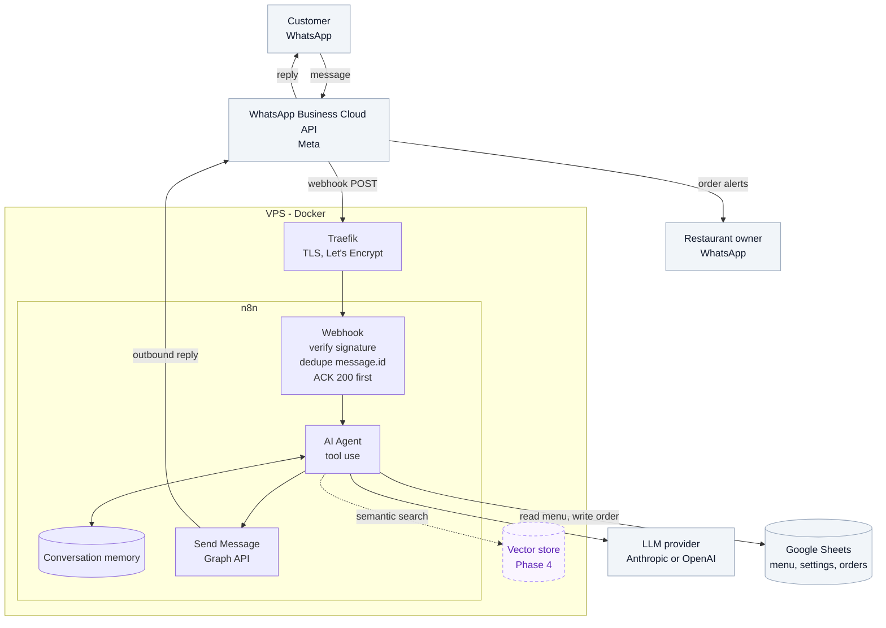

# WhatsApp AI Support Agent

An AI WhatsApp ordering agent for a Brazilian
restaurant, built with n8n, WhatsApp Business Cloud API, Google Sheets, and RAG. 

## What it does

- Answers questions about the menu, hours, delivery, and payment methods
- Walks a customer through a full order, start to confirmation
- Reads the menu live from Google Sheets, so the owner changes a price in
  a spreadsheet and the agent knows immediately
- Notifies the owner of each new order on WhatsApp
- Hands the conversation to a human when it can't help

**Stack:** n8n (self-hosted) · WhatsApp Business Cloud API · Google Sheets
· OpenAI · Qdrant _(vector store, added in a later phase)_

## Architecture

## Data architecture

The agent has two data tools and chooses between them based on user intent:
1. **Google Sheets** holds everything structured — menu, prices,
availability, business settings, the order log — and the agent reads it
directly, which means 100% recall on "how much is X?" for a menu this
size. 
2. **Qdrant** will hold everything that's a paragraph rather than a
value: ingredient deep-dives, allergen policy, the restaurant's story,
FAQ. 

Sheets ships first (Phases 1–3) so the conversational logic gets
validated before retrieval quality enters the debugging surface. Qdrant
is added in Phase 4 as a second tool. The long version is
in [`docs/data-architecture.md`](docs/data-architecture.md).

## Start here

**If you're reading the design** — the runtime lives on a server, so the
interesting parts of this repo are the decisions and the configuration
artifacts, not an app you can run:

| Read | For |
| --- | --- |
| [`docs/architecture.md`](docs/architecture.md) | The end-to-end path of one message |
| [`docs/data-architecture.md`](docs/data-architecture.md) | Why the agent splits Sheets and Qdrant, and how it picks |
| [`prompts/system-prompt.md`](prompts/system-prompt.md) | The agent's voice, tool rules, and ordering flow (Portuguese — rationale in English in [`prompts/README.md`](prompts/README.md)) |
| [`workflows/agent-main.json`](workflows/agent-main.json) | The n8n workflow that wires it together |
| [`DECISIONS.md`](DECISIONS.md) | Short ADRs for the tradeoffs that aren't visible in the code |

**If you're standing up your own copy** — follow the setup guides in this
order. Each one ends with a check you can run before moving on:

1. [VPS + n8n](docs/setup/n8n.md) — Docker, Traefik, TLS, and the n8n
   container
2. [WhatsApp Business Cloud API](docs/setup/whatsapp.md) — Meta app,
   phone number, webhook verification
3. [Google Sheets](docs/setup/google-sheets.md) — service account and the
   menu/orders sheets, seeded from [`templates/seed/`](templates/seed/)
4. Import [`workflows/agent-main.json`](workflows/agent-main.json) into
   n8n and paste in the system prompt
5. [Qdrant + knowledge ingestion](docs/setup/qdrant.md) — Phase 4, skip
   for now

Stuck? [`docs/troubleshooting.md`](docs/troubleshooting.md) collects the
failures worth writing down.

## Repo map

| Path | What's in it |
| --- | --- |
| `workflows/` | n8n workflow exports (the actual agent) |
| `prompts/` | System prompt, its changelog, and design notes |
| `knowledge/` | Portuguese prose for the Phase 4 vector store |
| `templates/seed/` | CSV seeds for the Google Sheets tabs |
| `docs/setup/` | Provisioning guides, one per external service |

## Roadmap

| Phase | Scope | State |
| --- | --- | --- |
| 1 | Data model, repo, n8n on Hostinger, WhatsApp Cloud API | In progress |
| 2 | Conversational agent | Planned |
| 3 | Ordering flow, owner notifications | Planned |
| 4 | Qdrant vector store + knowledge ingestion | Planned |
| 5 | Marketing, scheduled broadcast workflows | Planned |
| 6 | Monitoring and iteration | Planned |

## License

MIT