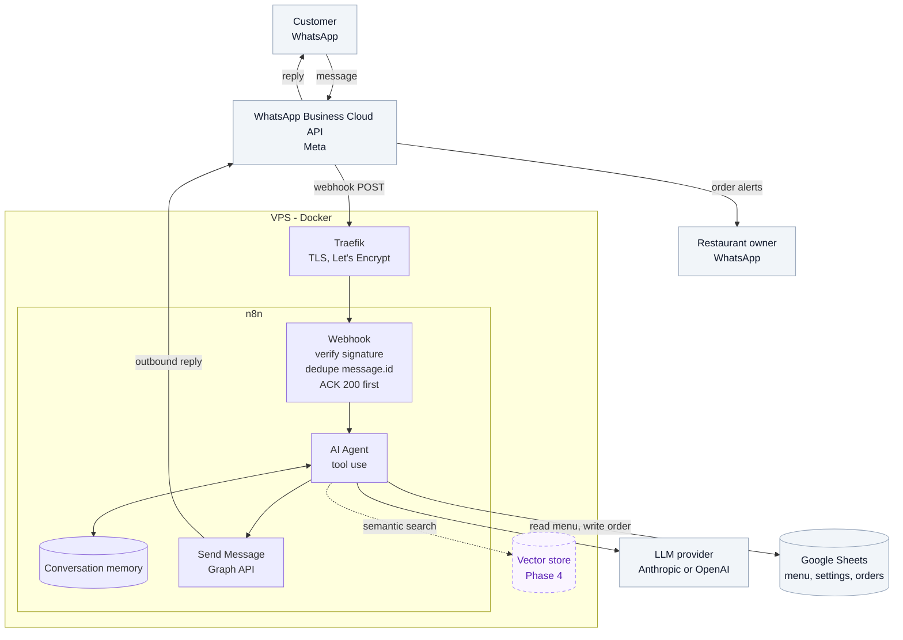

# System architecture & data flow

How one customer message becomes a reply, and the constraints that
shaped the design.

This document covers the design. Node-by-node detail for the n8n
workflows lands once they're built and running — see
[`workflows/README.md`](../workflows/README.md) for what exists today.

## The picture

Dashed edges are Phase 4. Source: [`images/architecture.mmd`](images/architecture.mmd).

## The path of one message

1. The customer sends a WhatsApp message. Meta receives it and POSTs a
   webhook payload to the VPS.
2. Traefik terminates TLS and proxies to n8n on port `5678` over the
   Docker network.
3. The webhook node checks the request signature, drops the payload if
   it's a duplicate, and returns `200` before any AI work starts.
4. The agent loads the conversation history for that phone number,
   reads what it needs from Google Sheets, and calls the LLM.
5. The reply goes out as a fresh `POST` to the Graph API
   (`/{phone-number-id}/messages`), not as the webhook's HTTP response.
6. If the turn completed an order, the agent writes a row to the
   `orders` tab and notifies the owner.

Steps 3 and 5 are the part worth understanding.

## Why the reply isn't the webhook's response

Meta expects a `200` within a few seconds and retries the delivery if it
doesn't get one. A turn of this agent takes 3–10 seconds: an LLM call
plus one or more Sheets round trips.

If the reply were the HTTP response, every slow turn would look like a
failure to Meta, Meta would retry, and the agent would process the same
message again — while the first run is still going. The visible symptom
is duplicate replies, and once ordering is wired up, duplicate orders.

So the webhook acknowledges immediately and the reply travels back as a
separate outbound API call. The inbound and outbound paths are
independent. The diagram shows them as separate edges for that reason.

## Two things that have to be true at the door

**The payload has to be authentic.** Every POST from Meta carries an
`X-Hub-Signature-256` header — an HMAC-SHA256 of the raw body, keyed
with the app secret. It gets computed and compared before anything else
runs. Without that check the endpoint is an open door: the URL is
guessable enough, and the agent writes to a spreadsheet.

The GET verify-token handshake is a different mechanism and not a
substitute. It runs once, when the webhook is first subscribed, and
offers nothing at runtime.

**The message has to be new.** Because Meta retries, the same message
can legitimately arrive more than once. Every payload is keyed on
`entry[0].changes[0].value.messages[0].id` and dropped if that ID has
been seen. A short-lived store is enough — n8n static data, or a tab in
Sheets if it needs to survive restarts.

## Where state lives

| State | Lives in | Lifetime |
| --- | --- | --- |
| Conversation history | n8n memory, keyed by customer phone number | Rolling window per conversation |
| Menu, prices, availability | Google Sheets, `menu` tab | Owner edits it directly, read live |
| Hours, delivery area, payment methods | Google Sheets, `settings` tab | Same |
| Completed orders | Google Sheets, `orders` tab | Append-only log |
| Seen message IDs | n8n static data | Short — only needs to outlive Meta's retry window |

Nothing about the business lives in the prompt. Hours and delivery zones
sit in `settings` as key-value rows so the owner can change them
without anyone editing a prompt or redeploying a workflow.

## The two failure paths

The agent has one job it must never improvise: pricing and allergens. A
wrong answer there costs more than a slow one, so the prompt has an
explicit escalation path that hands the conversation to the owner rather
than guessing. It's a named route, not a fallback for when everything
else fails — see [`prompts/README.md`](../prompts/README.md).

The other path is a hard failure: Sheets unreachable, LLM timeout, Meta
returning an error on send. The customer gets an acknowledgement rather
than silence, and the turn is logged. Building this out is Phase 6 work.

## What changes in Phase 4

One node. The agent gains a Qdrant tool alongside the Sheets tool and a
routing rule for choosing between them, and `ingest-knowledge` starts
running to keep the collection current. Qdrant runs as a second
container on the same VPS, reachable from n8n at `http://qdrant:6333`.

Nothing above changes. That's the point of the staging — see
[`data-architecture.md`](data-architecture.md).